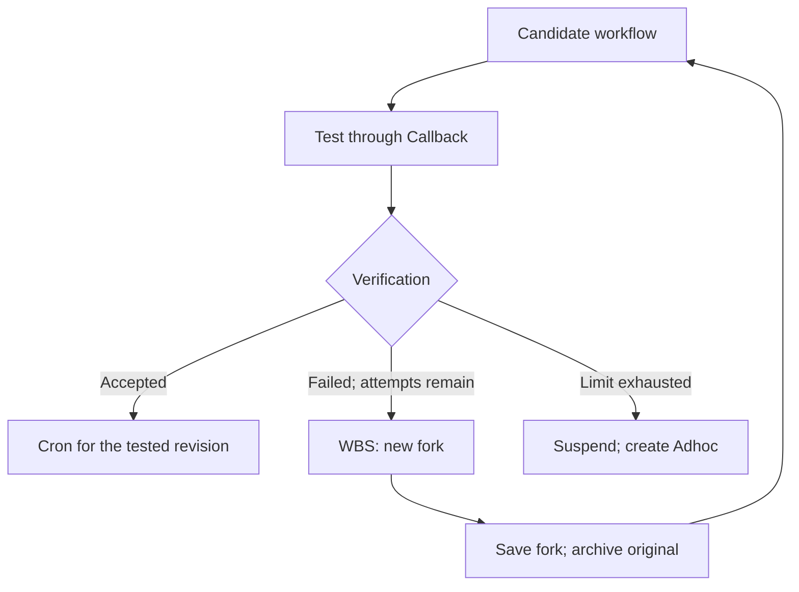

# Practical SAPi configs: expressiveness, compilation, and validation plan

> Harness update, October 4, 2026: the original analysis below is retained as
> prototype history. The implementation now includes isolated n8n 2.41.5,
> Harbor tasks, independent verifiers, and a separate codex-exec adapter.
> See [README.md](../README.md) for reproduction. Actual execution success is
> established by a specific `reports/<run>/report.json`, not earlier local JS
> driver results. At the recorded comparison, GitHub main matched the baseline
> commit; the comparison is in `provenance/spec-comparison.json`.
>
> This English translation preserves the historical scope and status statements.
> References to unavailable infrastructure and unimplemented features below
> describe the original prototype, not the current checkout.

October 4, 2026. Based on the new [SapiensSpecNotation.hs](https://github.com/aleski-green/sapiens4/blob/06ddd3333109cea8a2cb3071609070d7a3c0d3ff/documentation/haskell-notation-specs/SapiensSpecNotation.hs),
commit `06ddd3333109cea8a2cb3071609070d7a3c0d3ff`.

**Static workflows can be described compactly. The main difficulty is defining
branching, attempts, parallelism, and version changes precisely. The new Haskell
notation supplies a model foundation, not a complete execution language.**

Five standalone YAML configs and a small testable prototype were assembled.
The first three produced demo n8n JSON whose JavaScript was tested locally.
Import and execution in real n8n had not yet been checked. LLMs were replaced
with stubs. The backend explicitly rejected configs four and five: their rules
must not silently disappear during JSON generation.

## Problem, objective, and design principles

Valid YAML and importable JSON can describe different processes. This becomes
particularly visible when a branch is skipped, two tasks must finish before an
answer is assembled, a model revises a previous result, or WBS releases a new
revision of an active workflow.

The objective is to define a limited, unambiguous workflow profile and verify
that concrete executors preserve its meaning. Then measure SAPi's ability to
create such configs from a user's request.

Project principles:

1. Pin the specification revision and explicitly identify project extensions.
2. Define inputs, ordering, conditions, and output before generating nodes.
3. Keep logical operations in YAML and implementation bindings in the catalog.
4. Reject unsupported guarantees with a clear reason.
5. Evaluate language validity, compilation, runtime, and task quality separately.
6. Compare results and invariants rather than graph text.
7. Add a new behavior class only with positive and negative examples.

## What the new specification provides

| New Haskell notation | Proposed config | Additional definitions required |
| --- | --- | --- |
| WorkflowRef: ID and Revision | `workflow.id`, `revision` | Definition storage and execution history |
| Pipeline / Gantt | `workflow.kind` | Concrete Script and AgencyCall implementations |
| Plan: steps, dependencies, acceptance | Corresponding workflow fields | Data binding, conditions, joins, executable verifier |
| ScriptStep / LLMStep | `kind: Script / LLM`, `uses` | Operation catalog and data schemas |
| ByCron / ByCallbackTrigger | `activation` | Admission, events, deduplication, ReactionPolicy |
| WBS and new workflow forks | Draft `lifecycle` | Release transactions, archiving, schedule replacement |

The specification explicitly calls itself design notation. Script, AgencyCall,
and Condition remain textual leaf types; arbitrary text does not automatically
translate into executable code. For example, `uses: research.product` works
because the operation is registered in advance, not because the compiler
understands an arbitrary research description.

This revision places the old WorkGraph/WorkFlow types and their organizational
constraints outside the replacement's scope. `workgraph.yaml` can remain a
filename, but mandatory dates or the old rule that all steps in a WorkGraph
belong to one Sapi should not be inherited automatically.

The proposed profile is named `sapi-lab/v0`. It is experimental; compatibility
with the previous Python PoC was not checked. Its DAG restriction is our choice:
the new specification requires a cycle policy rather than banning all cycles.

## Five scenarios and their actual complexity

Estimates are relative: low means a small amount of work within the existing
profile. These are neither estimates in days nor promises of production readiness.

| Config | Behavior | Writing YAML | Implementing execution | Prototype result |
| --- | --- | --- | --- | --- |
| 01 invoice-total | Validate invoices → sum → produce result | Low | Low | Demo JSON, local execution |
| 02 ticket-routing | Classify → choose one branch → return draft | Medium | Medium: skipped and join | Demo JSON, both branches checked |
| 03 competitor-report | Two independent analyses → combine → write report | Medium | Medium; higher with real Sapi | Demo JSON, both sources preserved |
| 04 revise-answer | Generate → check → revise, at most 3 attempts | Medium | Higher: feedback and attempt history | Config; controller required |
| 05 digest-lifecycle | Candidate → test → WBS rebuild or enable Cron | Higher | High: versions and durable state | Config; orchestrator required |

**01. Calculation.** Three invoices total 38,000 AED minor units, or 380 AED.
Duplicate IDs, mixed currencies, negative amounts, and overflow are rejected.
This is a deterministic Pipeline without hidden model calls.

**02. Routing.** In a real system, the LLM step should return a typed priority.
The demo stub returns high when the delay exceeds two days. One operation creates
an escalation draft; the other creates a normal-response draft. Nothing is sent.
The relevant semantics are expressed as:

```yaml
- id: result
  kind: Script
  uses: branch.select_one
  join: all_terminal
  with:
    escalated: {optional_ref: steps.escalate}
    normal: {optional_ref: steps.normal}
```

`optional_ref` specifically means a skipped branch. A missing result does not
become null. This contract distinguishes correct branch selection from a data
transfer defect.

**03. Combined report.** Product and marketing read their explicitly supplied
materials; combine waits for both; writer uses their combined result. The config
contains logical Sapi roles, but actual actor isolation and memory are absent.
No dependency means either order is valid, not that simultaneous execution is required.

With n8n execution order v1, branches run sequentially. Guaranteed parallelism
therefore needs a separate dispatch/join mechanism; the demo backend rejects
`required_parallel`. [n8n execution order](https://docs.n8n.io/build/flow-logic/understand-execution-order).

**04. Answer correction.** The check requires an order ID and limits length.
Feedback is passed into the next generation; there are at most three generations,
including the first. A failed final attempt is not returned as accepted output.
This is substantive answer revision; a node retry does not define such a loop.
It could compile to a stateful attempt controller or an unrolled bounded number
of iterations. The controller is more suitable for stopping, auditing, and
recovery. Neither option was implemented in the prototype.

**05. Daily digest.** The [source case](https://github.com/aleski-green/sapiens4/blob/06ddd3333109cea8a2cb3071609070d7a3c0d3ff/documentation/haskell-notation-specs/cases/02-daily-digest.md)
describes team creation, WBS, testing, rebuilding, and enabling daily Cron.
It is a lifecycle around an executable workflow, not a single workflow-instance file.

Our 05 is an intentionally reduced interpretation: a candidate body
prepare → summarize → preview plus a separate lifecycle draft. Creating a Group,
assigning a Lead, and publication by four Sapi are not implemented.



Production needs more than one n8n JSON: workflow definitions, a controller,
revision/attempt storage, and schedule bindings. n8n can execute operations and
some control logic, but atomic release and crash resilience need separate
implementation. `max_rebuilds: 2` permits at most three candidates.

## Format scalability

A synthetic static graph was checked: 64 analyses and a tree of 63 combines,
for 127 logical steps. It produced 193 n8n nodes and 932,038 bytes of JSON.
The local JS driver preserved each of the 64 source markers exactly once,
and the trace contained 127 events. This checks a large static graph; it does
not measure n8n, LLM, or distributed-runtime throughput.

The prototype copies helper code and the accumulated envelope between nodes.
Production would need reusable handlers and controlled data transfer. Manually
writing hundreds of steps is also inconvenient: templates/subflows would need
to expand into a graph that can be checked.

Complexity primarily depends on behavioral variety. A hundred independent static
steps are simpler than five steps requiring parallelism, external effects,
feedback, and recovery. Dynamic fan-out over an unknown collection, human review,
compensation, and distributed locks were not tested by this experiment.

## Compiler design

Proposed sequence: YAML → profile validation → normalized IR → backend
capability checks → target artifacts. A separate runtime adapter handles start,
wait, cancellation, and result retrieval.

Shared interfaces: `validate(source)`, `check_capabilities(ir, backend)`,
`compile(ir, bindings)`, and `run(artifact, inputs, limits)`.
The current IR is still ordinary dicts: a foundation for an experiment.

| Construct | Demo n8n implementation | Requirements for real execution |
| --- | --- | --- |
| Script | Code v2 | Versioned handlers and complete I/O schemas |
| LLMStep | Code with an explicitly marked stub | HTTP Request to Agency bridge, validation, budgets |
| Guard | Check inside Code, skipped envelope | Preserve the same semantics under optimization |
| Join | Merge v3.2 append → combining Code | Validate waiting and errors in real n8n |
| Callback | Manual Trigger injects a fixture | Event adapter, admission, deduplication |
| Cron | Rejected by demo backend | Schedule Trigger and launch policies |
| Refinement | Rejected by demo backend | Attempts, feedback, stopping conditions |
| WBS lifecycle | Rejected by demo backend | Registry, transactions, controller, retargeting |

Merge append waits for connected inputs. In the demo, every conditional branch
passes a bookkeeping item even when skipped, so a join should not wait for a
missing input. This design still needed checking in real n8n.
[Merge documentation](https://docs.n8n.io/integrations/builtin/core-nodes/n8n-nodes-base.merge/).

Agency calls were proposed through HTTP Request because Code nodes restrict
network and filesystem access. [Code documentation](https://docs.n8n.io/integrations/builtin/core-nodes/n8n-nodes-base.code/).
A draft bridge contract was already in `bindings.yaml`; the service was absent.

A new workflow using existing operations needs no new backend code. A new
operation needs a handler and binding. A new control construct needs semantics,
runtime support, and tests. A second executor, such as a Python runtime, should
pass the same checks. None was implemented, so portability was not established.
The local JS driver checks generated code and does not replace an independent
reference interpreter.

## Existing evidence and outstanding checks

Five files pass the narrow profile checks. Twenty-one local tests cover results,
alternative inputs, the priority threshold, skips, missing branches, reference
errors, Pipeline restrictions, and rejection of unsupported semantics.
The 127-step graph was also checked separately.

The validator is not a complete formal verification system: lifecycle is only
partially checked, nested output types are incompletely described, and acceptance
is still prose. Passing these checks does not demonstrate real LLM answer quality.
Complete limitations are listed in [PROFILE.md](PROFILE.md).

## Plan from language definition to prompt benchmark

This plan lists work and progression criteria, not completion status.

| # | Task | Artifact and progression criterion |
| --- | --- | --- |
| 1 | Study and pin the new specification and cases | Core/extension mapping; no implicit inheritance of old constraints |
| 2 | Manually describe scenarios and expected behavior | Fixtures, expected outputs, errors, branch and attempt invariants |
| 3 | Define the YAML profile and operation catalog | Unambiguous refs, skipped, joins, limits; schema and useful diagnostics |
| 4 | Build three reference n8n workflows manually | Calculation, branching, fan-in; saved exports and executions |
| 5 | Compare generated workflows with references | Matching outputs and invariants on all deterministic cases |
| 6 | Add real Agency and a second executor | Shared contracts; parity on the supported profile, model quality evaluated separately |
| 7 | Implement bounded refinement | First/later-attempt success, exhaustion, invalid output, timeout |
| 8 | Implement digest lifecycle | Exact tested revision, fork/archive, crash/restart, deduplication, Cron replacement |
| 9 | Package stable execution in Harbor | Clean trial, passing oracle, rejected deliberately wrong solution |
| 10 | Run prompt → YAML → compile → run benchmark | Held-out tasks, independent verifier, separate stage diagnostics |

Items 7–8 can follow the first limited-profile benchmark if refinement and
lifecycle are explicitly excluded. Full specification support is not required
to start measurement.

Proposed hypotheses: H1 — existing constructs suffice for new static tasks;
H2 — compilation preserves behavior; H3 — a second backend executes the same
YAML without changing its meaning; H4 — SAPi creates configs for held-out tasks.
A counterexample to H1 is needing a special key per scenario. For H2/H3 it is
a difference in output, branch, or attempt count. For H4 it is systematic
planning errors while the runtime functions correctly.

The proposed gate from configs to a benchmark is: all agreed deterministic
cases pass in a real runtime, incorrect variants are rejected, and every run
saves definition revision, inputs, outputs, and trace. This is a project proposal,
not a Haskell or Harbor requirement. Three successful runs do not prove support
for all workflows; the report must state the tested scope.

## Concrete Docker and Harbor work

Terminal access to Docker would close the remaining gap between JSON generation
and real n8n. The first series would use isolated test n8n, three small fixture
workflows, negative inputs, then a large static graph. No models or external
services are needed at that stage. Import instructions and expected results
are described in README.md.

The next series adds an Agency bridge, then errors/timeouts and restart handling.
Each run should save the exact image version, execution ID, output, trace, and
a diagnostic category: validation / compilation / runtime / acceptance.
Connection to the user's computer had not been established at the prototype
stage; that environment had neither Docker nor n8n.

Harbor supplies the experiment harness. A task combines instruction, environment,
and tests. In the proposed Compose design, `main` contains runner/compiler,
with n8n and bridge as sidecars. [Task format](https://docs.harborframework.com/tasks/overview),
[multiple containers](https://docs.harborframework.com/tasks/multi-container).

Each scenario needs:

| File | Contents |
| --- | --- |
| `instruction.md` | User task, inputs, constraints, and result path |
| `task.toml` | Task version, limits, and collected artifacts |
| `environment/Dockerfile` | Pinned runner/compiler dependencies |
| `environment/docker-compose.yaml` | n8n and optional bridge; health checks |
| `solution/solve.sh` | Reference solution for validating the harness itself |
| `tests/test.sh` | Independent verifier invocation and reward output |

Initially, a trial receives prepared YAML to test execution. A separate trial
then receives only the request, data, and profile description; SAPi must create
the YAML. Both modes use the same verifier. It checks the result and required
invariants from outputs and logs, without trusting an agent's claim of completion.
The criterion does not require textual equality with reference YAML.

A Harbor verifier writes a numeric result to `/logs/verifier/reward.txt` or
named metrics to `reward.json`. Proposed metrics are `valid_config`, `compiled`,
`runtime_ok`, and `task_pass`, with raw traces and errors saved separately.
[Verifier documentation](https://docs.harborframework.com/tasks/verifier).

A pilot could preselect ten new tasks within the supported profile and use
three attempts per task, recording model, prompts, limits, and cost. This is a
research starting point, not sufficient statistics for production quality.
Refinement and lifecycle should be evaluated separately after implementation.
