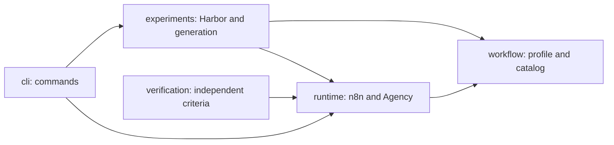

# Project architecture

This reorganizes the existing research harness without extending `sapi-lab/v0`
semantics. Compilation and execution remain separate actions.

## Structural reference

The reference is [Sapiens CONTRIBUTING at the pinned revision](https://github.com/aleski-green/sapiens4/blob/06ddd3333109cea8a2cb3071609070d7a3c0d3ff/CONTRIBUTING.md):
organize code by responsibility, keep runtime independent of the host, avoid
import cycles, and preserve behavior during refactoring. The parent's Python
code is divided into `corpora/runtime/computer`. This project has three different
responsibilities: `workflow/runtime/experiments`. Its scope does not require
copying the parent's desktop or web modules.

The `src` layout makes tests use the installed package rather than accidentally
importing a module from the repository root. `pyproject.toml` defines Python
requirements, dependencies, wheel building, and CLI entry points. `uv.lock`
records resolved dependencies; normal execution uses `--locked`. Harbor is an
optional extra, so compilation does not require its cloud SDKs. See
[uv projects](https://docs.astral.sh/uv/concepts/projects/config/) and
[locked sync](https://docs.astral.sh/uv/concepts/projects/sync/).

An independent agent reviewed the design using Matt Pocock's `ask-matt` and
`codebase-design` skills. The design uses a small set of modules without a
plugin registry or a hierarchy of empty classes.

## Responsibilities and dependencies

- `workflow/profile.py`: YAML parsing with duplicate-key rejection, references,
  dependencies, actors, and profile validation. It knows nothing about n8n,
  Harbor, or Docker. `workflow/bindings.yaml` is the single source operation catalog.
- `runtime/n8n/compiler.py`: `compile_n8n(config, bindings, ...) -> (artifact, mapping)`.
  Applies backend capability limits and generates JSON. Adjacent JS files are
  included in the wheel. The compiler neither starts processes nor computes acceptance.
- `runtime/contracts.py`: the typed `WorkflowBackend` interface, `CompileOptions`,
  `CompiledWorkflow`, and `ExecutionRecord`. Compilation and execution are the
  two operations; expected business answers never enter this interface.
- `runtime/execution.py`: `run_case(config, artifact_dir, ..., backend=...)`.
  Owns compilation/execution orchestration and the common report. The CLI uses
  the same injected backend for compile, build, and execute. The sole production
  selection point is `runtime/composition.py::default_backend()`.
- `runtime/n8n/adapter.py` and `runtime/n8n/execution.py`: implement compilation
  and real n8n execution through that interface. The executor handles a fresh
  database, import, execution, raw-data extraction, and native artifact persistence.
  Success requires persisted n8n success and a Result node. The previous n8n
  `run_case` entry point delegates to the common orchestration for compatibility.
- `runtime/agency.py`: the HTTP contract between an LLM node and the existing
  wrapper, prompt construction, JSON validation, and safe auditing. The shared
  instruction is in `agency-prompt.md`; operation instructions are in the catalog.
- `experiments/`: manages series, environment dependencies, and reports. Harbor
  runs in the same Python environment as the installed package, without relying
  on an arbitrary global executable or manual `sys.path` changes.
- `verification/business.py`: independent arithmetic and scenario criteria using
  logical `WorkflowObservation` values from `verification/contracts.py`.
- `verification/n8n_provenance.py`: checks native execution identity, persisted
  data, node envelopes, ordering, and correspondence with logical observations.
- `verification/verify.py`: combines business acceptance and engine provenance,
  substitutes test inputs, and records the acceptance decision. Runtime never
  imports it. The independent verifier accepts `runner=` for local orchestration
  tests; this does not make native n8n evidence portable to other engines.

`tests/test_packaging.py` protects import direction and excludes reference
solutions from generation packages. Existing behavioral tests are retained.

## Adding another executor

Implement `WorkflowBackend.compile()` and `.execute()` alongside `runtime/n8n/`,
then select it at the composition point or inject it into the common CLI/runtime
interface. Keep the shared parser/profile and business criteria. Local test
adapters exercise this replacement without importing or launching n8n; they
demonstrate the seam and do not establish a second production executor.

A one-setting replacement is not promised. Native evidence, capabilities,
waiting/branching semantics, and provenance checks must be defined for the new
executor. The native provenance module currently checks n8n nodes and its version;
another executor must supply its own evidence adapter before acceptance can be
claimed. The structural Protocol requires no inheritance, registry, universal IR,
or placeholder Sapiens implementation.

Sapiens as an **agent authoring YAML** and Sapiens as a **YAML executor** are
separate experiments. This refactoring implements neither.

## Why reports still contain copies

`experiments/tasks.py::stage_tasks()` assembles packages from canonical sources:

| Source | Assembled package contents |
| --- | --- |
| `harbor/tasks/<scenario>/instruction.md` | `instruction.md` for oracle/live |
| `generation/tasks.json`, `FORMAT.md`, profile, catalog | `instruction.md` for generation |
| `configs/0N-*.yaml` or validated frozen replay mapping | `environment/base.yaml`, oracle/live/replay only |
| `harbor/templates/` | task.toml, test.sh, solve.sh; solve is oracle/live only |
| `verification/*.py` | hidden verifier modules in `tests/` |
| `verification/cases.json` | `tests/cases.json` for the selected scenario only |

These are distribution copies for isolated execution, not separate maintained
implementations. The destination directory must be new. Exact packages are saved
with results. Generation packages contain no solution/base.yaml; their containers
remove `/app/lab/configs` and `/app/scenario`. Tool restrictions in the existing
wrapper still rely on prompting and stderr auditing; this is not a secure benchmark.

## Environments

The host uses `uv sync --locked --extra harbor`, Python 3.14.8, and the project's
`.venv`. The compiler and bridge can be installed from a wheel and used outside
a checkout. Experiments require an editable installation of the selected checkout
and its fixtures/templates. A package/source mismatch is rejected before a run,
so recorded hashes cannot describe a different implementation. `SAPI_LAB_ROOT`
selects the checkout explicitly; otherwise it is discovered from the working
directory or editable installation. Runtime does not search for a checkout.

Containers use pinned n8n/Alpine and Python/PyYAML from `infra/Dockerfile`.
This is a separate minimal runtime without Harbor or development dependencies.
The package is supplied through `/app/lab/src` and `PYTHONPATH`; there is no pip
resolution during a case. Reports record container versions separately from
the host lockfile.

Python support is explicitly `>=3.14,<3.15`, with an exact 3.14.8 interpreter pin
matching the container. This is the verified minor series; it does not claim
support for older versions or 3.15 prereleases. The lock keeps Harbor 0.21.0 as
an optional extra. An immutable official Astral download catalog allows the
pin to work with uv 0.12.4 without changing the user's global Python or Harbor.

The source archive includes fixtures, templates, public specification provenance,
and reproduction settings. The public provenance allowlist contains `provenance/SapiensSpecNotation.hs`,
`provenance/spec-comparison.json`, and `provenance/spec-source.json`. The latter
records the upstream repository, immutable revision, source path, and snapshot hash;
[spec source maintenance](SPEC-SOURCE.md) verifies it offline and compares explicit upstream refs. Local environment
snapshots, reports, generated exports, validation outputs, and review dumps remain
in the working checkout and are excluded from Git, wheels, and source archives.
`infra/check_distribution.py` verifies this by building actual archives from a
temporary checkout containing private sentinel files.

`experiments/provenance.py` hashes all public source modules and data, including
new files under the owned directories. Both Harbor manifests and generation
fingerprints use this same inventory. Per-run host versions are recorded locally
without environment variables or machine paths. Existing evidence is never
rewritten when paths or dependencies change.

## Automated checks

Ruff checks lint and formatting; mypy checks all application and verifier Python
modules with `check_untyped_defs`. The only missing-import exception is the
optional third-party Harbor package, which supplies no typing marker. Local
tests exercise behavior, import direction, backend replacement, task packaging,
and source-inventory privacy. Distribution checks also verify installed resources.

`.github/workflows/checks.yml` runs those checks for pull requests and pushes.
The separate Docker/Harbor job is selected manually and uses deterministic
transport/oracle/nop controls. Live model calls are never part of CI. Neither job
uploads local execution artifacts.

## Commands

`uv run --locked sapi-lab --help` lists every subcommand in two groups, and each
one accepts `--help`. The first group is what a person runs; the second holds
entry points a container or another command invokes, which have no use at a host
checkout. This project uses `--locked`, not `--frozen`, everywhere: the CI
workflow `.github/workflows/checks.yml` runs `uv sync --locked` and
`uv run --locked` for all steps. `--locked` additionally verifies that `uv.lock`
still agrees with `pyproject.toml` and fails if it does not, which is what the
pinned-environment statements in the reports rely on. `--frozen` would skip that
check. Terms used below are defined in the [glossary](GLOSSARY.md).

### Commands you run

| Command | What it does | Also needs | Costs model calls |
| --- | --- | --- | --- |
| `compile` | Validate one YAML and write the n8n JSON plus its step-to-node map. It does not execute anything. | — | No |
| `build` | Compile every `configs/*.yaml` into `--output-dir` and record which were rejected. | — | No |
| `harbor` | The unpaid control suite: build the pinned image, run transport probes, then the oracle and nop trials. | `--extra harbor`, Docker | No |
| `generate` | Model-authored YAML. Runs the control suite first and refuses to continue if it fails, then dispatches independent one-shot authoring attempts. | `--extra harbor`, Docker, the wrapper | Yes |
| `live` | Replay frozen generated submissions with live runtime operations, after an unpaid source-matched gate. | `--extra harbor`, Docker, the wrapper | Yes |
| `benchmark` | The AutoWFBench task evaluation, with `--task checkout` or `--task crm`. `--mode prepare` and `--mode controls` dispatch nothing. | `--extra harbor --extra benchmark`, Docker | `--mode live` only |
| `benchmark-series` | Build a comparison manifest from existing reports. It reruns nothing. | `--extra benchmark` | No |
| `benchmark-calibrate` | Compare the semantic judge against frozen evaluator-only controls. **It dispatches one real, paid judge call** unless `--prepare-only` is passed. | `--extra benchmark` | Yes, unless `--prepare-only` |
| `ui` | Compile and import graphs into local n8n, and prepare one bounded manual live session. | local n8n | Only when you press Execute on an LLM graph |
| `lifecycle` | The durable lifecycle controller: `register`, `callback`, `restore`, `status`, `tick`, `drain`, `serve` against a registry directory. Same entry point as the `python -m sapi_config_lab.runtime.lifecycle` form used in the [lifecycle guide](LIFECYCLE.md). | — | Only with `--llm-mode live` or `--rebuilder-url` |
| `review-export` | Write a derived `analysis.md` beside recorded evaluations so the Harbor viewer can display them. It adds files only; `evaluation.json` is read-only to it. | a Harbor jobs directory | No |

`checkout` is a deprecated hidden alias of `benchmark`. It still works and prints
a deprecation line to stderr. The module serves two tasks selected by `--task`,
so the old name advertised one of them as if it were the whole command. Use
`benchmark`; `checkout` will be removed.

### Internal and in-container commands

These run from the same entry point and are not hidden, but a host checkout is
the wrong place to type them: each needs an environment it does not get there.

| Command | What it does | Why it is not for you |
| --- | --- | --- |
| `execute` | Run one config through the selected engine and write a `sapi-lab-execution/v1` record. | Requires the real n8n CLI 2.41.5 on `PATH`, which the lab image provides and a host checkout normally does not. Use `harbor` or `live` for a real execution with evidence. |
| `package-tasks` | Assemble Harbor task packages into a new directory without running them. | Every experiment stages its own packages; a standalone package is for inspection only. |
| `transport` | Deterministic HTTP transport probes against a fake bridge. | Written to run inside the isolated lab image, where `run.sh` invokes it; outside that image it has no workspace to probe. |
| `bridge` | Foreground local Agency adapter in front of the existing wrapper. | `live` and `ui` start it themselves; a second one competes for the port and the budget latch. |
| `checkout-worker` | The trusted in-container verifier that runs frozen YAML through the real n8n backend. | The task container runs it as `python3 -m sapi_config_lab.experiments.checkout_worker`; it reads `/tests/connection.json` and writes `/logs/verifier`. |

`benchmark-calibrate` costs one model call. The module docstring in
`src/sapi_config_lab/experiments/judge_calibration.py` states this, and the
command prints the model it is about to bill to stderr immediately before
dispatching. `calibration_fixture()` on its own is unpaid: it only swaps prose in
an already recorded trace. Budget for the dispatch accordingly.

## Command migration

| Previous command | Current command |
| --- | --- |
| `python3 lab.py compile ...` | `uv run --locked sapi-lab compile ...` |
| `python3 lab.py build` | `uv run --locked sapi-lab build` |
| `python3 scripts/run_harbor.py ...` | `./run.sh ...` |
| `python3 scripts/run_live.py ...` | `uv run --locked --extra harbor sapi-lab live ...` |
| `python3 scripts/run_generation.py ...` | `./run-generation.sh ...` |
| `python3 scripts/n8n_runtime.py ...` | `uv run --locked sapi-lab execute ...` (requires n8n CLI) |
| `python3 bridge/agency_bridge.py ...` | `uv run --locked sapi-lab bridge ...` |
| `python3 verification/sync_tasks.py` | Removed; packages are assembled before each run |
| `python3 -m unittest discover ...` | `uv run --locked python -m unittest discover -s tests -v` |

`build` now saves build-results.json alongside exports in `--output-dir`.
Old Python entry points were removed; both shell commands were retained.
See [MIGRATION-PATHS.json](MIGRATION-PATHS.json) for the complete file map.
Historical reports and source manifests are not rewritten to use new paths.

## Frozen generated replay

`experiments/replay.py` validates the exact preselected historical artifacts and
provenance. `stage_tasks(mode="replay", submissions=...)` preserves their bytes.
`experiments/live.py` reuses Harbor and the existing verifier/typed backend path,
with source/image gates, unpaid replay verification and serial live trials.

Replay mode is reachable only through `sapi-lab live --submissions-manifest`.
`package-tasks --mode` offers `oracle` and `generation` and deliberately not
`replay`: a replay package is defined by a submissions manifest that
`load_selection()` revalidates against a frozen source report, and by the image
tag that the same `live` run freezes and pins into its hashes. Staged on its own
with a default image tag, the package would carry no provenance anything checks.
The `--mode` help text says so at the command.
`runtime/agency.py::DispatchAudit` owns the outgoing budget and failure latch;
`experiments/live_evidence.py` reconciles it with independent native evidence.
There is no additional workflow executor. See [the replay command](GENERATED-LIVE.md).
